# MALWARE ANALYSIS REPORT

## Zhujikdo Campaign: Multi-Stage Job Application Phishing Delivering zgRAT and PureHVNC via DLL Sideloading and Process Injection

---

| | |
|---|---|
| **Report Reference** | MAR-2026-001 |
| **Date of Analysis** | 06 March 2026 |
| **Date of Report** | 10 March 2026 |
| **Analyst** | Prince Lassey |
| **Threat Level** | **CRITICAL** - Full system compromise capability, active targeting of individuals and confirmed victim impact |

---

## Campaign Overview

| Attribute | Details |
|-----------|---------|
| **Campaign Name** | Zhujikdo *(derived from malware install directory)* |
| **Malware Families** | zgRAT, PureHVNC, DonutLoader *(classified by ANY.RUN)* |
| **Target Sector** | Job seekers *(social engineering via fake job offers)* |
| **Delivery Vector** | Google Forms short link -> ZIP -> Executable |
| **C2 Infrastructure** | 15.235.172.37 (OVH SAS, France) <br> Ports: 56001, 56002, 56003, 56004, 7705 |
| **Files Analysed** | 7 files  |
| **Detection Rate (VirusTotal)** | Primary EXE: 0/72 <br> Malicious DLL: 2/72 |


## Analysis Environment

| Category | Details |
|----------|---------|
| **Platform** | FLARE VM (Windows 10) |
| **Network** | Isolated - FakeNet-NG intercepting all traffic |
| **Sandbox** | ANY.RUN (cloud) |


## Tools Used

| Type | Tools |
|------|-------|
| **Static Analysis** | Hashmyfiles, PEStudio, CFF Explorer, Detect It Easy (DIE) |
| **Dynamic Analysis** | Process Monitor, Regshot, Process Explorer |
| **Network Analysis** | FakeNet-NG, Wireshark |
| **Sandbox** | ANY.RUN and FLARE.VM (isolated) |
| **OSINT** | VirusTotal |

---

## Table of Contents

| Section | Title |
|---------|-------|
| **1** | [**Executive Summary**](#executive-summary) |
| **2** | [**Sample Identification**](#sample-identification) |
| **3** | [**Static Analysis**](#static-analysis) |
| **4** | [**Dynamic Analysis**](#dynamic-analysis) |
| **5** | [**Indicators of Compromise (IOCs)**](#indicators-of-compromise-iocs) |
| **6** | [**MITRE ATT&CK Framework Mapping**](#mitre-attck-framework-mapping) |
| **7** | [**Conclusions and Recommendations**](#conclusions-and-recommendations) |
| **8** | [**Screenshhots**](#screenshots) |
| **9**| [**References**](#references) |


---

## EXECUTIVE SUMMARY 

This report documents the analysis of a targeted malware campaign delivered through a fake job application scheme. The attack is designed to appear completely harmless to the recipient.

A victim receives what appears to be a legitimate job offer for a Digital Marketing position, linked from a real Google Forms page. Theform provides a link to download  a job description package. That download is a ZIP file containing an executable program.

When opened, the executable displays a professional-looking PDF job description to the victim. While the victim reads this document, believing they are reviewing a genuine job offer, the malware silently installs itself in the background. This was confirmed through dynamic analysis: the malware drops files, loads malicious components, and
writes a persistence entry to the Windows registry, all within seconds of execution, with no visible indication to the user.

The malware then establishes a persistent foothold on the victim's computer. It registers itself to run automatically every time the computer starts, disguised under a name resembling a Microsoft Edge update. This means the infection survives reboots and logoffs, and will continue operating until explicitly detected and removed.

Once installed, the malware initiates encrypted communications to a remote server controlled by the attacker located at an OVH-hosted IP address in France. During this analysis, the remote server did not respond as the malware was analysed in an isolated environment specifically to prevent a live connection. However, it was observed
continuously attempting to reach the server, confirming automated command-and-control beaconing behaviour.

The final payload was classified by the ANY.RUN malware sandbox as DonutLoader, zgRAT and PureHVNC. They are malware families with documented capabilities for remote desktop control, credential theft, session cookie harvesting, keystroke logging, and screen capture. These capabilities were not individually observed during this analysis due to the isolated environment, but are consistent with the malware's identified families and its observed import profile (the technical functions it is built to
call).

These capabilities explain the pattern reported by affected individuals that, shortly after running the file, someone attempted to access their LinkedIn accounts. zgRAT is documented to harvest browser session cookies.. the digital tokens that keep a user logged into websites. Although browsers encrypt these cookies, the encryption is
tied to the logged-in Windows user account. Because the malware runs within the victim's own user session, it has the ability to decrypt and extract these cookies. With a stolen session cookie, the attacker can access the victim's LinkedIn account or any other platform the victim is logged into, without needing the password and without
triggering a multi-factor authentication prompt.

The malware achieved near-total evasion of antivirus detection at the time of analysis:

  - The delivery executable was undetected by all 72 antivirus engines on VirusTotal (0/72)
  - The loader component (a trojanised Windows system DLL) was detected by only 2 of 72 engines (2/72).
  - An additional encrypted data file used by the malware did not match any recognised file format and was not flagged by any
    engine.

This evasion is achieved by splitting the malware into three separate components: a delivery layer (the executable), a loader layer (the DLL), and a believed-to-be encrypted data file with no file extension. No single component is independently malicious — the executable itself is a legitimate Python deployment tool, and the encrypted data file cannot be executed on its own. The malware only becomes operational when all three components work together.

Based on the payload classifications, the malware's observed behaviour, and the reported victim impact, this infection is assessed to constitute a full system compromise. The combination of persistence, encrypted command-and-control communications, and the documented capabilities of zgRAT and PureHVNC would give the attacker ongoing
access to the infected system and the ability to extract credentials, session tokens, and other sensitive data for as long as the malware remains installed and the command-and-control server is operational.

The primary objective is assessed to be account takeover and credential theft, likely for use in further social engineering attacks, fraud, or resale of compromised accounts. However, the capabilities of the installed malware extend far beyond any single platform and represent a potential complete loss of control over the infected system.

---

## SAMPLE IDENTIFICATION

### 2.1 Submission Details

| Attribute | Details |
|-----------|---------|
| **Submission URL** | `https://forms.gle/QwLkXnzGnaxzXw8W9` |
| **Full Analysis URL** | [ANY.RUN Task](https://app.any.run/tasks/a0cd19c6-c7d4-4287-bbba-eb7acb40e846) |
| **Analysis Date** | 08 March 2026, 00:25:23 UTC |
| **Analysis Platform** | Windows 10 Professional (Build 19044, 64-bit) |
| **Analyst Environment** | FLARE VM (Isolated, No Internet Access) |

### 2.2 File Inventory and Hashes

All hashes were computed on the analysis machine unless otherwise noted.

| File # | Filename | MD5 | SHA256 | Notes |
|--------|---------|-----|--------|-----------------------------|
| 1 | Job application form Digital Marketing.zip | f5d3ac84a2602c060b4071873f5cd235 | 7ba885e23c0fa4a898c25ebb2dc536db71d7a1b4b8011feef51bf38d08b77bb1 | Downloaded via Google Forms short link |
| 2 | Job application form Digital Marketing.exe | 183edf6dd1ef070eb3d386090354acaf | 4b840844ce458265427c1d9f11917bd94b84561ae7add3252e56cfb8f567e305 | Primary executable |
| 3 | pythonw.exe | 8ad6c16026ff6c01453d5fa392c14cb4 | ff507b25af4b3e43be7e351ec12b483fe46bdbc5656baae6ad0490c20b56e730 | Dropped Python interpreter |
| 4 | Job_Information.pdf | b03c85680e7775acdef55348303114c7 | b0eb1fc394d86f422ab96439fb8a682c7fb846e3194514443d26b35e68313f4 | Decoy document displayed to victim |
| 5 | Image.png | 78b7c9995fb603d8bbf2bd9e0a6a89f9 | ac66e85455976668810e81fa38d8598d697681217ffdf3138e19a3eff397e6a7 | Dropped image file; used as argument for pythonw.exe |
| 6 | Msimg32.dll | 35dc0eb76ce0c528f597021ba8cc8e80 | 1fae83eb001a2b7cd828397689b6cd56c13392c3497dab033470cd3808a2a3b1 | Sideloaded DLL (157 MB, unsigned) |
| 7 | winhttp2 | 0dcc1dfd7e9b7a7cdb27b1e49b7be10a | 96b6eb087a4081d016a06996e4ccf0e2b0a8c9599b0238659d2ec966d4eb83dc | Unidentified binary; possibly encrypted/encoded |

**Notes:**  

- File 5 (`Image.png`) despite the `.png` extension likely contains embedded data passed as a command-line argument to `pythonw.exe`.  
- File 6 (`Msimg32.dll`) is **157 MB**, whereas the legitimate DLL is ~10 KB and Microsoft-signed.  
- File 7 (`winhttp2`) is not a valid PE file; the byte pattern indicates encryption or encoding.

### 2.3 Malware Family Classification

| Attribute | Details |
|-----------|---------|
| **Classification Source** | ANY.RUN sandbox analysis |
| **Primary Families** | DonutLoader, PureHVNC, zgRAT |
| **Obfuscation** | .NET Reactor (detected via ANY.RUN YARA in calc.exe) |
| **Delivery Method** | Phishing via Google Forms short link + ZIP archive |
| **Execution Layer** | Python 3.10 (PyInstaller-bundled EXE) |
| **Sideloading Target** | Msimg32.dll |
| **Install Directory** | `C:\ProgramData\Zhujikdo\` |

**Family Descriptions:**

- **zgRAT:** A Remote Access Trojan known for credential and data exfiltration,
    process injection, code obfuscation, and persistence. It is commonly
    distributed through loaders such as DonutLoader. 
- **PureHVNC:** A Virtual Network Computing based remote access tool that provides
    live screen viewing, keyboard and mouse control, and screenshot
    capture. It operates as a hidden VNC session, invisible to the victim. 
- **DonutLoader:** A shellcode generation framework that converts .NET assemblies, PE
    files, and other payloads into position-independent shellcode for
    injection into running processes. Its presence is consistent with
    the process injection into calc.exe observed during dynamic analysis.


### Attack Chain
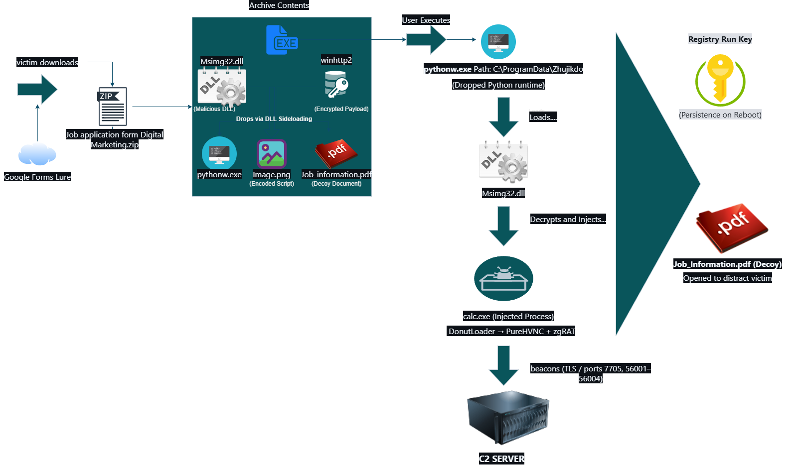

### Social Engineering


---

## STATIC ANALYSIS

---

### 3.1 File Hashing and Integrity Verification

| Item | Details |
|-----|--------|
| **Tool Used** | HashMyFiles |
| **Environment** | FLARE VM (offline) |

- All file hashes were computed and cross-referenced against the ANY.RUN sandbox report.

- The anomalously large size of **`Image.png` (3.1 MB)** and its role as a runtime argument to **`pythonw.exe`** suggest that it serves as an **embedded data carrier or configuration file disguised as an image** rather than a normal PNG image.

---

# 3.2 VirusTotal Detection Check

| Item | Details |
|-----|--------|
| **Tool Used** | VirusTotal |
| **Submission Method** | Hash-only submission (no file upload) |

### Detection Results

| File | Detection Rate |
|-----|---------------|
| Primary EXE | 0/72 |
| Msimg32.dll | 2/72 |
| winhttp2 | 0/72 (no match found) |

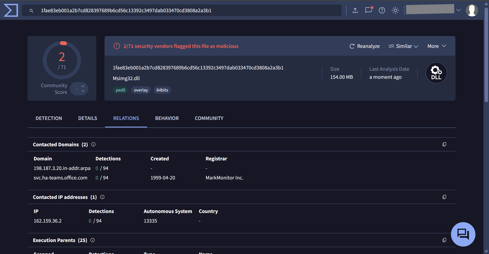

- The near-zero detection rates confirm that the threat actor engineered the delivery chain so that **no single component appears malicious in isolation**.  

- This design approach is a **hallmark of staged malware delivery chains designed for detection evasion**.

### VirusTotal Alias Observations

VirusTotal shows that the same executable has been uploaded under multiple filenames including:

- KMPlayer 64X / KMPlayer64.exe  
- Wondershare Filmora Installer  
- Valorant TriggerBot  
- ABO Compensation and Benefits Structure.exe  
- 1. Project Overview MSI CLAW 8 AI+.exe  

These aliases indicate that the **same executable has been reused across multiple campaigns**, with the attacker simply changing the filename to match different social engineering themes.

This behaviour is consistent with the use of a **reusable framework**.

---

# 3.3 Compiler and Packer Detection

| Item | Details |
|-----|--------|
| **Tool Used** | Detect It Easy (DIE) |

### Compiler Analysis

| File | Compiler | Toolchain | Notes |
|----|----|----|----|
| **Primary EXE** | Microsoft Visual C/C++ (19.00.24210) [LTCG/C++] | Visual Studio 2015 | Native Windows C++ application acting as a wrapper that bundles and deploys the Python runtime and payload files |
| **Msimg32.dll** | Microsoft Visual C/C++ (19.00.24210) [LTCG/C++] | Visual Studio 2015 | Built with the same compiler toolchain as the EXE |
| **winhttp2** | Unknown | Unknown | Not a valid executable and cannot be run directly |

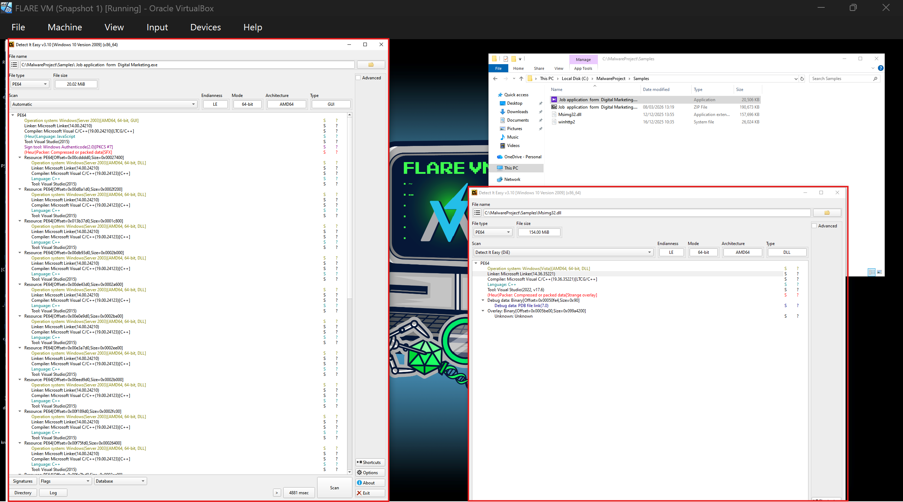

### Assessment

- The **matching compiler toolchain between the EXE and DLL strongly suggests they were built together** as part of the same malware development project.

- Based on file placement, import behaviour, and compiler metadata, the following **three-stage delivery chain is assessed**:

| Stage | Component | Role |
|-----|-----|-----|
| Stage 1 | Primary EXE | Loader responsible for deploying runtime components |
| Stage 2 | Msimg32.dll | Malicious DLL used for sideloading and payload execution |
| Stage 3 | winhttp2 | Binary payload likely processed by the DLL |

This execution chain is **assessed based on static indicators only** and was **not confirmed through reverse engineering**.

---

# 3.4 PE Header Analysis - Primary EXE

| Item | Details |
|-----|--------|
| **Tool Used** | PEStudio |

---

## 3.4.1 DLL Sideloading Confirmation

- The EXE imports **`MSIMG32.dll`** in its import table.

- Because the malware places a malicious **`Msimg32.dll`** in the same directory as the EXE, Windows loads the **malicious copy instead of the legitimate system DLL**.

- This technique is known as: [**DLL Search Order Hijacking**](https://redcanary.com/threat-detection-report/techniques/dll-search-order-hijacking/)


### Imports Supporting DLL Sideloading

| API | Purpose |
|----|----|
| LoadLibraryA / LoadLibraryW | Load DLLs dynamically |
| LoadLibraryExA / LoadLibraryExW | Advanced DLL loading |
| GetProcAddress | Resolve API addresses dynamically |
| SetDllDirectoryW | Modify DLL search paths |

---

## 3.4.2 Process Injection Indicators

The following imports indicate that the executable contains functionality capable of **manipulating other running processes**.

| API | Purpose |
|----|----|
| WriteProcessMemory | Write code into another process |
| ReadProcessMemory | Read memory from another process |
| VirtualAlloc | Allocate memory inside processes |
| VirtualProtect | Change memory permissions |
| VirtualQuery | Query memory layout |
| CreateToolhelp32Snapshot | Enumerate running processes |
| Thread32First / Thread32Next | Enumerate threads |
| OpenThread | Obtain a thread handle |
| SuspendThread | Pause a running thread |
| GetThreadContext / SetThreadContext | Modify thread registers |
| CreateProcessW | Create new processes |
| CreatePipe | Inter-process communication |


---

## 3.4.3 Persistence Indicators

| Registry API | Purpose |
|----|----|
| RegCreateKeyExA / RegCreateKeyExW | Create registry keys |
| RegSetValueExA / RegSetValueExW | Write registry values |
| RegSetValueA / RegSetValueW | Modify registry values |
| RegDeleteKeyA / RegDeleteKeyW | Delete registry keys |
| RegDeleteValueA / RegDeleteValueW | Remove registry values |

These APIs allow malware to **create persistence mechanisms through Windows registry run keys**.

---

## 3.4.4 Surveillance Indicators

| Capability | APIs |
|----|----|
| Keylogging | GetAsyncKeyState |
| Keyboard monitoring | GetKeyboardState, GetKeyState |
| Raw input capture | RegisterRawInputDevices, GetRawInputData |
| Global keyboard hooks | SetWindowsHookExW, CallNextHookEx, UnhookWindowsHookEx |
| Clipboard monitoring | OpenClipboard, GetClipboardData, SetClipboardData |
| Active window tracking | GetForegroundWindow, GetWindowThreadProcessId |
| Screen/display enumeration | GetDesktopWindow, GetMonitorInfoW |

These APIs indicate the malware **contains functionality for monitoring user activity**.

Cross-reference note:

All import indicators observed during static analysis are **consistent with behaviour observed at runtime** in both the **FLARE VM dynamic analysis** and the **ANY.RUN sandbox execution**.

---

# 3.5 PE Header Analysis - Msimg32.dll (Malicious)

| Item | Details |
|-----|--------|
| **Tool Used** | PEStudio |

---

## 3.5.1 Size Anomaly

| File | Size |
|----|----|
| Malicious Msimg32.dll | 157,696 bytes (157 MB) |
| Legitimate Msimg32.dll | ~10 KB |

- This size difference is **extremely abnormal** for this DLL.

- The additional size may be used for:
  - Embedded payload storage

The exact purpose of this size inflation was **not determined through static analysis**.

---

## 3.5.3 Digital Signature

| Property | Result |
|----|----|
| Legitimate Msimg32.dll | Microsoft signed |
| Malware Msimg32.dll | Unsigned |

An **unsigned DLL using the same name as a legitimate Windows system library** strongly indicates something fishy.. in this case, **DLL sideloading**.

---

## 3.5.4 Flagged Imports

### Memory Manipulation

| API |
|----|
| VirtualProtect |
| LoadLibraryW |
| GetProcAddress |

### File System Access

| APIs |
|----|
| CreateFileW |
| ReadFile |
| WriteFile |
| FindFirstFileW / FindFirstFileExW |
| FindNextFileW |
| CreateDirectoryW |
| CopyFileW |
| CreateHardLinkW |
| CreateSymbolicLinkW |
| GetFileInformationByHandleEx |
| GetTempPathW |
| GetEnvironmentStringsW |

### Process Identification

| APIs |
|----|
| GetCurrentProcess |
| GetCurrentProcessId |
| GetCurrentThreadId |

- These APIs allow the program to **read files from disk, modify memory permissions to allow execution, and dynamically resolve functions**.

- A **graphics rendering DLL has no legitimate reason to perform these operations**.

---

# 3.6 Payload Analysis - winhttp2

| Item | Details |
|----|----|
| Tools Used | CFF Explorer, Detect It Easy |
| File Type | Unknown |
| Executable | No |
| First Bytes | 48 FB A8 FF 6D EA 46 76 70 26 8F FD 37 A7 91 F6 |

Both analysis tools confirm that **winhttp2 is not a valid PE file** and does not match any recognised file format.

Additional observations:

- The file has **no extension**
- The first 16 bytes **do not match any known file signature**

### Assessment

Given that:

- `Msimg32.dll` imports **file reading APIs**
- `Msimg32.dll` imports **memory execution APIs**
- `winhttp2` exists in the **same directory**

It is assessed that **winhttp2 may be a payload file intended to be read and executed by Msimg32.dll at runtime**.

However, this relationship was **not confirmed through reverse engineering**

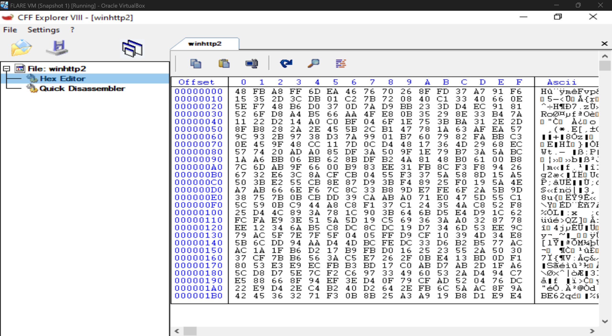

---

# 3.7 Cross-Reference - Static Analysis vs ANY.RUN Observation

| STATIC ANALYSIS | ANY.RUN OBSERVATION |
|---|---|
| EXE will load Msimg32.dll via sideload | DLL sideloading was observed |
| pythonw.exe running from `C:\ProgramData\Zhujikdo\` | Python runtime was dropped |
| `MicrosoftEdgeSyscalls_Updates` key observed | Registry Run key was written |
| calc.exe likely used for injection | calc.exe flagged as malicious |
| 15.235.172.37 observed | Network connections to C2 observed  |
| DonutLoader / PureHVNC / zgRAT | Detected via YARA memory signatures |
| Decoy PDF displayed in Edge | Acrobat.exe opened PDF |

Static analysis successfully predicted **all major runtime behaviours before execution**, validating the analysis.

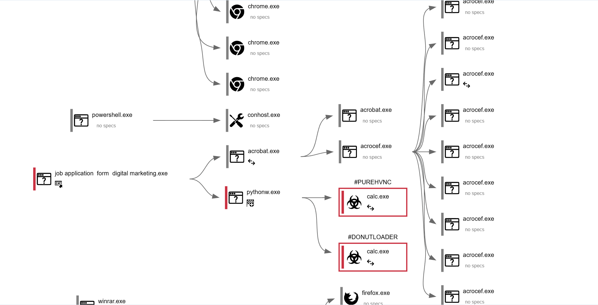  
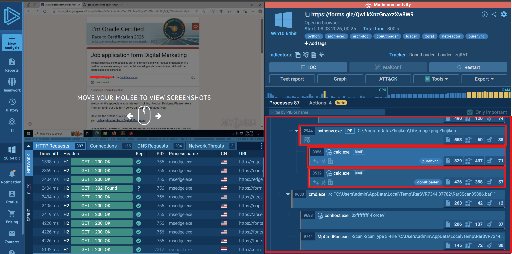

---

# 3.8 Static Analysis Summary

## Confirmed Findings

- The EXE is a **C++ wrapper that deploys a Python runtime environment**
- The EXE loads **Msimg32.dll via DLL sideloading**
- `Msimg32.dll` is **157 MB**, larger than the legitimate DLL.
- `Msimg32.dll` is **unsigned**
- `winhttp2` is **not a valid PE**
- Installation directory: `C:\ProgramData\Zhujikdo\`

---

## Assessed Findings

- `winhttp2` is likely **encrypted or encoded payload data**
- `Msimg32.dll` likely **reads and processes winhttp2 at runtime**
- DLL import profile suggests potential capabilities including:

| Capability | APIs |
|---|---|
| Keystroke capture | GetAsyncKeyState, SetWindowsHookExW |
| Clipboard access | OpenClipboard, GetClipboardData |
| Screen capture | BitBlt, CreateCompatibleBitmap |
| Network communication | WinHTTP / socket APIs |

These behaviours are **consistent with Remote Access Trojan (RAT) functionality**, but were **not confirmed in execution**.

---

## DYNAMIC ANALYSIS

## 4.1 Environment Preparation

### 4.1.1 Snapshot Restoration

Prior to execution, the FLARE VM was restored to a clean snapshot saved before any analysis activity. This ensured that no artefacts from static analysis tools contaminated the dynamic execution environment.

--- 

### 4.1.2 Network Interception

| Parameter | Value |
|---|---|
| Tool | FakeNet-NG |
| Configuration | All outbound connections intercepted and logged locally |
| Purpose | Captures C2 communication attempts without reaching the real attacker infrastructure |
| Status | Running prior to sample execution |

---

### 4.1.3 Pre-Execution Baseline

| Item | Detail |
|---|---|
| Tools | Regshot (first snapshot) |
| Actions taken before executing the sample | Regshot first snapshot |

This baseline establishes the clean system state against which all post-infection changes are measured.

---

## 4.2 Execution and Process Tree Observation

| Tool Used |
|---|
| Process Explorer |

---

### 4.2.1 Process Tree Observed


- The process tree structure matched between the FLARE VM execution and the ANY.RUN sandbox execution.

---

### 4.2.2 Process Tree Analysis

The use of calc.exe (Windows Calculator) as the injection target is a deliberate evasion choice. Calculator is a trusted, signed Windows binary. By injecting malicious code into a trusted process, the malware makes its network connections and memory operations appear to originate from a legitimate system application.

**Abnormal observations confirmed**

| Observation | My View |
|---|---|
| calc.exe parent is pythonw.exe  | impossible for legitimate calculator use |
| calc.exe establishes outbound network connections  | the Windows Calculator does not connect to the internet LOL |
| calc.exe contains PureHVNC and DonutLoader shellcode in memory  | ANY.RUN YARA detection |
| calc.exe may contain zgRAT in memory dumps | ANY.RUN YARA detection |

---

### 4.2.3 Decoy Document Delivery

A PDF file (Job_Infomation.pdf) immediately opens after execution. This serves as the social engineering distraction layer as the victim's attention is directed to reading a job offer document while the infection chain completes in the background.

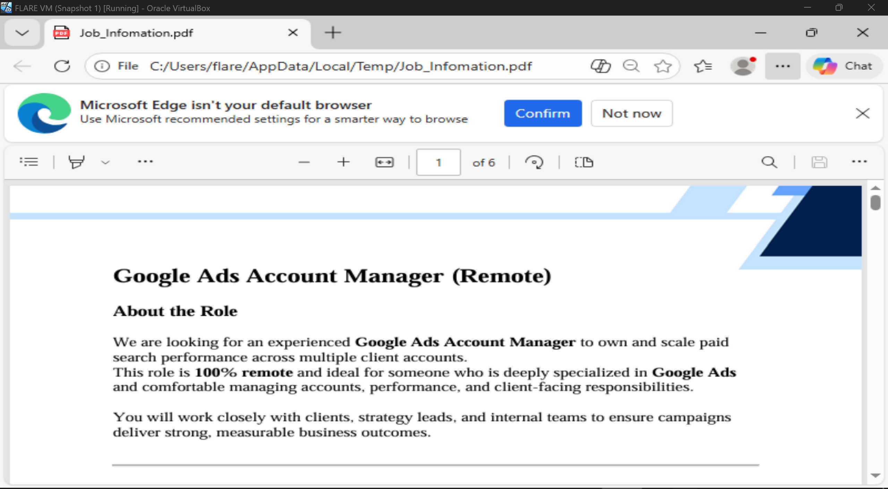

---

### 4.2.4 Files Dropped by pythonw.exe

| Timestamp | File Path | Size |
|---|---|---|
| 18:35:02.300 | `C:\ProgramData\Zhujikdo\python310.dll` | 4 MB |
| 18:35:02.366 | `C:\ProgramData\Zhujikdo\vcruntime140.dll` | 77mb |
| 18:35:04.025 | `C:\ProgramData\Zhujikdo\python3.dll` | 69mb |
| 18:35:04.059 | `C:\ProgramData\Zhujikdo\_bz2.pyd` | 73mb |
| 18:35:08.830 | `C:\ProgramData\Zhujikdo\_ctypes.pyd` | 110mb |
| 18:35:08.858 | `C:\ProgramData\Zhujikdo\libffi-7.dll` | 32mb |
| 18:35:08.893 | `C:\ProgramData\Zhujikdo\Lib\__pycache__\syscall.cpython-310.pyc.21609160` | 15mb |

- Confirmed:

  - All files were written by pythonw.exe, confirming the EXE extracted and deployed a complete Python 3.10 runtime environment into the **C:\ProgramData\Zhujikdo\** directory.

  


---

### 4.2.5 Registry Persistence (Process Monitor)

**Key written**

| Field | Value |
|---|---|
| Path | HKCU\SOFTWARE\Microsoft\Windows\CurrentVersion\Run\MicrosoftEdgeSyscalls_Updates |
| Type | REG_SZ |
| Data | `"C:\ProgramData\Zhujikdo\pythonw.exe" "C:\ProgramData\Zhujikdo\Lib\Image.png" "Zhujikdo"` |

Confirmed:

- Process Monitor recorded pythonw.exe writing a registry Run key on two occasions. The key is located under **HKCU\SOFTWARE\Microsoft\Windows\CurrentVersion\Run**, which Windows executes automatically at each user logon. This establishes persistence as the malware will relaunch after every reboot or logoff without user interaction.

- The key name **MicrosoftEdgeSyscalls_Updates** is crafted to resemble a legitimate Microsoft Edge update process, consistent with defence evasionn.

- The registry value reveals the execution chain at persistence:
```
    pythonw.exe loads "Image.png" with argument "Zhujikdo"
                       │
                       └─ Despite the .png extension, this file is
                          assessed to be a script or data file, not
                          an image. The use of a misleading file
                          extension is consistent with masquerading
                          (T1036.008 — Masquerade File Type).
```

[Process Monitor showing RegSetValue operationfor MicrosoftEdgeSyscalls_Updates](images/run.png)  
[Process Monitor showing Image.png](images/image.png)

---

### 4.2.6 Code Protector Detection (.NET Reactor)

| Field | Value |
|---|---|
| Detected in | calc.exe |
| Detection | ANY.RUN YARA signature match |
| Protector | .NET Reactor (commercial .NET obfuscation tool) |

Confirmed:

- ANY.RUN's YARA rules identified the presence of .NET Reactor within the calc.exe process. **.NET Reactor** is a commercial code protection tool used to obfuscate .NET assemblies, preventing static analysis and decompilation.

- Its detection confirms that the payload executing within calc.exe is a .NET assembly that has been deliberately obfuscated to hinder analysis.

- The use of a commercial protector such as .NET Reactor indicates the threat actor invested in defence evasion to delay or prevent reverse engineering of the final payload.

---

## 4.3 winhttp2

### 4.3.1 File Type Identification

| Parameter | Value |
|---|---|
| Tools used | CFF Explorer, Detect It Easy (DIE) |
| Result | Not a valid Portable Executable or any recognised file format |
| Extension | None |
| Header | 48 FB A8 FF 6D EA 46 76 70 26 8F FD 37 A7 91 F6 |

Confirmed:

- CFF Explorer and Detect It Easy both confirm that winhttp2 is not a valid PE file and does not match any recognised file format. The file has no extension. The first 16 bytes do not correspond to any known file signature.

---

### 4.3.3 Relationship to Msimg32.dll

Assessed:

- winhttp2 was found in the same directory as the malicious Msimg32.dll. Msimg32.dll imports file-reading APIs (CreateFileW, ReadFile) and memory manipulation APIs (VirtualProtect, LoadLibraryW, GetProcAddress) that would enable it to read an external file, modify memory permissions, and execute its contents.

- Based on the co-location of both files and the import profile of Msimg32.dll, it is assessed that winhttp2 serves as a data file read by Msimg32.dll at runtime. The exact relationship between the two files was not confirmed through reverse engineering or dynamic analysis.

- The identification of DonutLoader, PureHVNC, and zgRAT was established through ANY.RUN sandbox detection (memory dumps and YARA rules). The connection between winhttp2 and these payloads is assessed but was not directly traced during this analysis.

---

## 4.4 Registry Comparison (Regshot Before/After)

| Parameter | Value |
|---|---|
| Tool Used | Regshot 1.9.1 x64 Unicode |
| Before shot | 2026-03-08 19:10:51 |
| After shot | 2026-03-08 19:15:48 |

---

### 4.4.1 Key Registry Change - Persistence

| Field | Value |
|---|---|
| Added | HKU\S-1-5-21-1513963814-3082271264-4545881-1001\SOFTWARE\Microsoft\Windows\CurrentVersion\Run |
| Value | `"C:\ProgramData\Zhujikdo\pythonw.exe" "C:\ProgramData\Zhujikdo\Lib\Image.png" "Zhujikdo"` |

This registry key was added under the current user's Run key, which Windows executes automatically at every user logon. This is the confirmed persistence mechanism — the malware will relaunch after every reboot or logoff without user interaction.

---

### 4.4.2 Other Registry Observations

| Change Type | Count | Description |
|---|---|---|
| Keys deleted | 11 | Primarily OneDrive configuration and legacy Internet Explorer cache history entries |
| Keys added | 31 | Included standard Edge browser activity, OneDrive update markers, file extension associations, and shell bag entries |
| Values modified | 55 | Primarily system telemetry, notification data, scheduled task timestamps, and Background Activity Monitor (BAM) entries |

These were reviewed and are consistent with normal Windows housekeeping operations.

---

## 4.5 Network Activity (calc.exe - Injected Process)

| Tools Used |
|---|
| Process Monitor |
| Process Explorer |
| FakeNet-NG |
| Wireshark (PCAP) |

---

### 4.5.1 C2 Connections Observed

All outbound connections originated from **calc.exe**, which was identified as an injected proces.

| Parameter | Value |
|---|---|
| Destination IP | `15.235.172.37` |
| ASN | OVH SAS (France) |

**Ports contacted**

| Destination |
|---|
| 15.235.172.37:56001 |
| 15.235.172.37:56002 |
| 15.235.172.37:56003 |
| 15.235.172.37:56004 |
| 15.235.172.37:7705 |

Process Explorer and FakeNet-NG recorded calc.exe initiating outbound TCP connections to 15.235.172.37 across five distinct ports. The use of multiple ports from a single process is unusual for legitimate applications and is consistent with malware that separates command, data, and control functions across different channels.

The destination IP is hosted by OVH SAS, a cloud provider frequently abused by attackers for malware, spam, and ransomware, with reports including the Ebury malware family and ESXi ransomware attacks.

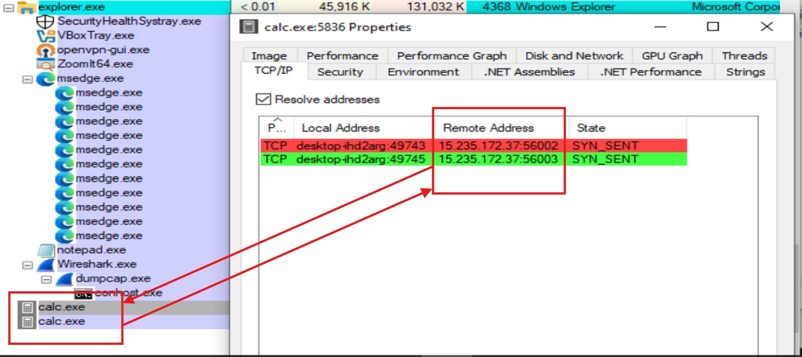  
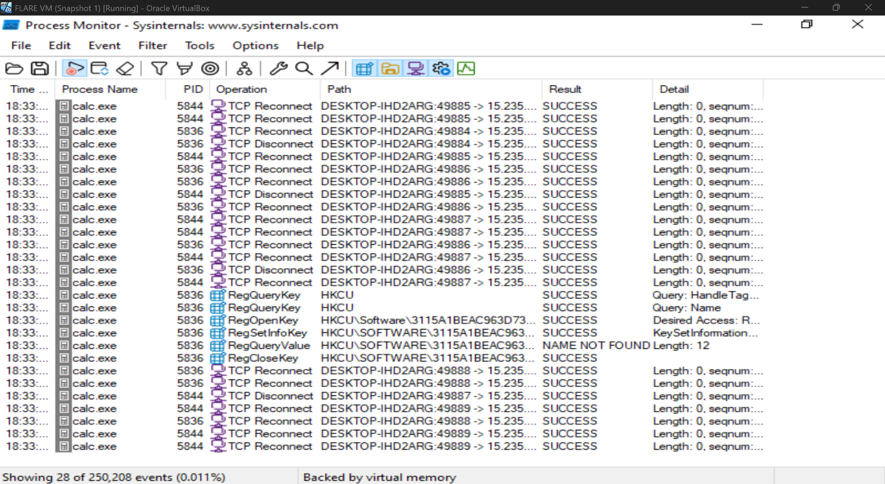

---

### 4.5.2 TLS Handshake Behaviour

Wireshark captured repeated TLS connection attempts from **calc.exe** to **15.235.172.37**. Each attempt followed this pattern:

| Step | Event |
|---|---|
| 1 | Infected host sends TLS Client Hello |
| 2 | Remote server responds with TLS Fatal Alert |
| 3 | Handshake terminates |
| 4 | Connection is retried automatically |

- The TLS handshakes consistently failed, with the server issuing Fatal Alert responses. This is expected in the analysis environment, where FakeNet-NG intercepted outbound traffic and the real C2 server was not reachable.

- The automatic retry behaviour.. I mean repeating the same connection sequence without user interaction makes this likely automated C2 beaconing, where the malware persistently attempts to establish contact with its operator.

- Assessed:

  - In a non-isolated environment where the C2 server was operational, a successful TLS connection would likely enable remote command and control. Based on the payload identifications zgRAT and PureHVNC as classified by ANY.RUN, the potential capabilities of an active C2 session may include:

| Potential Capability |
|---|
| Remote command execution |
| Credential and session cookie exfiltration |
| Live remote desktop viewing and control |
| Additional payload delivery |

   - These capabilities were not observed during this analysis, as no successful C2 connection was established.

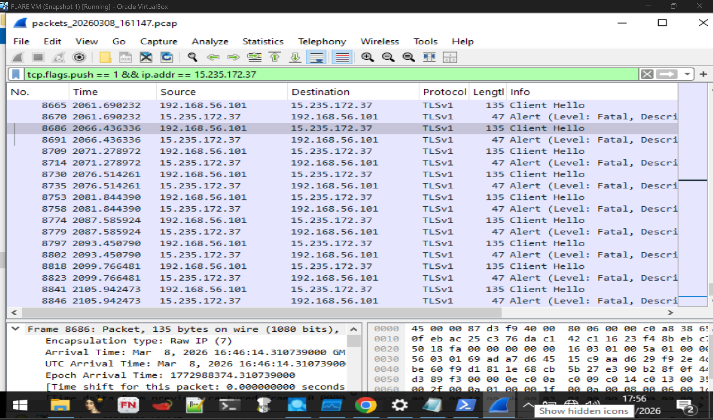

---

### 4.5.3 ANY.RUN Network Confirmation

ANY.RUN's sandbox analysis independently recorded the same IP `15.235.172.37` and on same ports thereby corroborating the C2 destination observed in my FLARE VM environment.

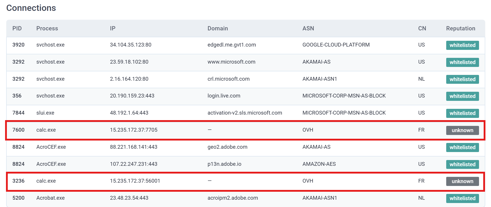

---

## INDICATORS OF COMPROMISE (IOCs)

### 5.1 File Hashes

| File | Type | MD5 | SHA256 |
|-----|-----|-----|-----|
| ZIP Archive | ZIP | `f5d3ac84a2602c060b4071873f5cd235` | `7ba885e23c0fa4a898c25ebb2dc536db71d7a1b4b8011feef51bf38d08b77bb1` |
| Malware Sample | EXE  | `183edf6dd1ef070eb3d386090354acaf` | `4b840844ce458265427c1d9f11917bd94b84561ae7add3252e56cfb8f567e305` |
| Python Runtime | pythonw.exe | `8ad6c16026ff6c01453d5fa392c14cb4` | `ff507b25af4b3e43be7e351ec12b483fe46bdbc5656baae6ad0490c20b56e730` |
| Job_description | PDF | `b03c85680e7775acdef55348303114c7` | `b0eb1fc394d86f422ab96439fb8a682c7fb846e31945f14443d26b35e68313f4` |
| Embedded Resource | Image.png | `78b7c9995fb603d8bbf2bd9e0a6a89f9` | `ac66e85455976668810e81fa38d8598d697681217ffdf3138e19a3eff397e6a7` |
| Msimg32.dll| Malicious DLL | `35dc0eb76ce0c528f597021ba8cc8e80` | `1fae83eb001a2b7cd828397689b6cd56c13392c3497dab033470cd3808a2a3b1` |
| winhttp2 | unknown | `0dcc1dfd7e9b7a7cdb27b1e49b7be10a` | `96b6eb087a4081d016a06996e4ccf0e2b0a8c9599b0238659d2ec966d4eb83dc` |

### 5.2 File System Artefacts

**Installation Directory**

```
C:\ProgramData\Zhujikdo\
```

**Dropped Files**

```
C:\ProgramData\Zhujikdo\pythonw.exe
C:\ProgramData\Zhujikdo\python310.dll
C:\ProgramData\Zhujikdo\python3.dll
C:\ProgramData\Zhujikdo\vcruntime140.dll
C:\ProgramData\Zhujikdo\_bz2.pyd
C:\ProgramData\Zhujikdo\_ctypes.pyd
C:\ProgramData\Zhujikdo\libffi-7.dll
C:\ProgramData\Zhujikdo\Msimg32.dll
C:\ProgramData\Zhujikdo\winhttp2
C:\ProgramData\Zhujikdo\Lib\Image.png
C:\ProgramData\Zhujikdo\Lib\__pycache__\syscall.cpython-310.pyc.[random]
```

---

### 5.3 Registry Artefacts

**Persistence Key**

```
HKCU\SOFTWARE\Microsoft\Windows\CurrentVersion\Run\
MicrosoftEdgeSyscalls_Updates
```

**Value**

```
"C:\ProgramData\Zhujikdo\pythonw.exe"
"C:\ProgramData\Zhujikdo\Lib\Image.png" "Zhujikdo"
```


### 5.4 Network Indicators

| Indicator | Value |
|---|---|
| C2 IP Address | `15.235.172.37` |
| Hosting Provider | OVH SAS (France) |
| ASN | AS16276 (OVH) |
| Ports | `7705`, `56001`, `56002`, `56003`, `56004` |
| Protocol | TLS (encrypted C2 channel) |

**Distribution URL**

```
https://forms.gle/QwLkXnzGnaxzXw8W9
```

### 5.5 Process Indicators

**Injected Process**

- **Process Name:** `calc.exe`
- **Parent Process:** `pythonw.exe` *(abnormal — legitimate calc.exe normally launches from Explorer or direct user interaction)*

**Observed Activity**

- Outbound TLS connections to `15.235.172.37`
- Multiple ports used for communication
- Memory payloads detected via ANY.RUN YARA signatures:
  - DonutLoader
  - PureHVNC
  - zgRAT

**Installation Directory Name**

```
Zhujikdo
```

## MITRE ATT&CK FRAMEWORK MAPPING

The following mapping is divided into techniques observed during this analysis and techniques assessed as expected based on the malware's identified capabilities and reported victim impact.

---

### Observed Techniques (confirmed through analysis)

| Tactic | Technique | ID |
|---|---|---|
| Initial Access | Phishing: Spearphishing Link | T1566.002 |
| Execution | User Execution: Malicious File | T1204.002 |
| Execution | Command and Scripting Interpreter: Python | T1059.006 |
| Persistence | Boot or Logon Autostart Execution: Registry Run Keys | T1547.001 |
| Defence Evasion | DLL Side-Loading | T1574.002 |
| Defence Evasion | Obfuscated Files or Information | T1027 |
| Defence Evasion | Process Injection | T1055 |
| Command and Control | Encrypted Channel | T1573.002 |
| Command and Control | Non-Standard Port | T1571 |

  Evidence basis:
  - T1566.002 : forms.gle short link detected in ANY.RUN; filename "Job application form Digital Marketing.exe" consistent with social engineering lure targeting job seekers
  - **T1204.002** : UserAssist and AppCompatFlags confirm user execution
  - **T1059.006** : pythonw.exe deployed with syscall.cpython-310.pyc
  - **T1547.001** : Registry Run key "MicrosoftEdgeSyscalls_Updates" written
  - **T1574.002** : Unsigned 161 MB Msimg32.dll loaded from application directory instead of System32
  - **T1027**     : .NET Reactor detected in calc.exe; winhttp2 is an unrecognised binary blob consistent with encrypted data
  - **T1055**     : calc.exe (spawned by pythonw.exe) exhibited C2 network activity and .NET Reactor signatures inconsistent with the legitimate Windows Calculator
  - **T1573.002** : TLS Client Hello attempts observed in Wireshark
  - **T1571**     : C2 connections on ports 56001–56004 and 7705


Expected Techniques (based on malware capabilities and reported impact):

| Tactic | Technique | ID |
|---|---|---|
| Collection | Input Capture: Keylogging | T1056.001 |
| Collection | Clipboard Data | T1115 |
| Collection | Screen Capture | T1113 |
| Credential Access | Credentials from Web Browsers | T1555.003 |
| Command and Control | Remote Access Software | T1219 |
| Exfiltration | Exfiltration Over C2 Channel | T1041 |

- Assessment basis:

  - These techniques were not directly observed during analysis, as C2 communications were intercepted by FakeNet-NG and no successful connection to the operator was established. However, they are assessed as expected capabilities for the following reasons:

    - **T1056.001 / T1115 / T1113** : Msimg32.dll's import table includes APIs consistent with keystroke capture (GetAsyncKeyState,SetWindowsHookExW), clipboard access (OpenClipboard,GetClipboardData), and screen capture (BitBlt,CreateCompatibleBitmap). These are consistent with the spyware capabilities of zgRAT as classified by ANY.RUN.
    
    - **T1555.003** : Following interaction with the malicious link, affected individuals reported unauthorised access attempts on their LinkedIn accounts. This is consistent with browser credential or session cookie theft, which is a documented capability of zgRAT. The exact mechanism of credential theft was not determined during this analysis.
    
    - **T1219** : ANY.RUN classified the payload as PureHVNC, a remote access tool that provides live desktop viewing and control. This capability was not observed due to the isolated analysis environment.
    
    - **T1041** : The malware established persistent C2 beaconing over TLS to 15.235.172.37. In an operational environment with a live C2 server, collected data (credentials, keystrokes, screenshots) would likely be exfiltrated over this channel.

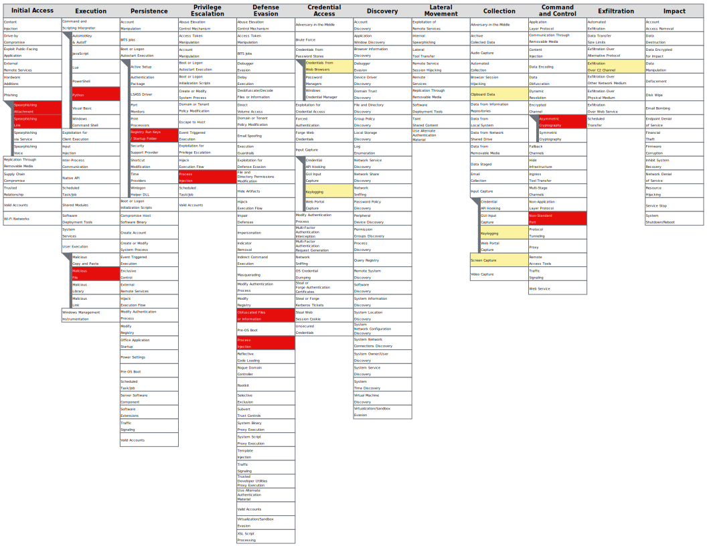

---

## CONCLUSIONS AND RECOMMENDATIONS


### 7.1  Conclusions

This investigation analysed a multi-stage malware operation targeting job seekers through social engineering. The analysis was conducted across static, dynamic, and network phases using PEStudio, CFF Explorer, Detect It Easy, Process Monitor, Regshot, Process Explorer, FakeNet-NG, Wireshark, and the ANY.RUN sandbox.

#### Confirmed findings:

The malware employs a three-component delivery chain:

  1. A C++ executable disguised as a job application form, which deploys a Python 3.10 runtime environment and sideloads a malicious DLL.

  2. A trojanised Msimg32.dll (157 MB, unsigned, with non-functional stub exports), which serves as a loader.

  3. An unidentified binary file (winhttp2) with no recognised file format, assessed to contain encrypted or encoded payload data.

This delivery chain achieved minimal antivirus detection at the time of analysis: 0/72 engines detected the primary executable, and 2/72 detected the loader DLL.

The malware establishes persistence through a registry Run key ("MicrosoftEdgeSyscalls_Updates") that relaunches the payload at every user logon. The key name is crafted to resemble a legitimate Microsoft Edge update process.

The final payload, classified by ANY.RUN as zgRAT and PureHVNC, was detected executing within calc.exe, consistent with process injection. The injected process initiated TLS-encrypted C2 beaconing to 15.235.172.37 (OVH SAS, France) across five ports (56001–56004, 7705). No successful C2 connection was established during analysis, as outbound traffic was intercepted by FakeNet-NG.


#### Assessed impact:

Based on the payload classifications (DonutLoader, zgRAT, PureHVNC) and the reported victim experience.. thus LinkedIn account access attempts shortly after executing the malware, the following impact is assessed:

  - **Credential and session theft:** zgRAT is documented to harvest browser session cookies from Chromium-based browsers (Chrome, Edge). Although browsers encrypt stored cookies using the Windows Data Protection API (DPAPI), this encryption is tied to the logged-in user account. Malware executing within the victim's user session as observed in this analysis (pythonw.exe and calc.exe both running under the victim's HKCU context) has the ability to call **CryptUnprotectData()** to decrypt cookies without additional credentials. A stolen session cookie  would allow the attacker to access the victim's authenticated session directly, bypassing both password and multi-factor authentication. This mechanism tallies with the reported unauthorised LinkedIn access attempts following execution of the malware. However, the cookie theft process was not directly observed during this analysis, as no successful C2 exfiltration occurred in the isolated environment.
  
  - **Remote desktop control:** PureHVNC provides live screen viewing and interactive control of the infected system. This capability was not observed due to the isolated analysis environment, but would be available to the operator upon successful C2 connection.

  - **Full system access:** The combination of persistence, process injection, and C2 beaconing indicates the attacker would have ongoing access to the infected system for as long as the malware remains installed and the C2 server is operational. In a non-isolated environment, this would constitute a full system compromise.


#### Analytical limitations:

  - No successful C2 connection was established during analysis. Operator commands, data exfiltration, and remote control were not observed.
  - The cookie theft mechanism described above is assessed based on zgRAT's documented capabilities. Actual cookie extraction and exfiltration were not captured during this analysis.
  - The winhttp2 file was not decrypted or reverse engineered. Its exact contents and relationship to Msimg32.dll remain assessed
    rather than confirmed.


### 7.2  Recommended Actions

#### 7.2.1  Immediate Actions (All Affected Individuals)

  1. STOP using the infected machine for any sensitive activity
     (banking, email, social media) until remediation is complete.

  2. From a SEPARATE, trusted device:

     a. Change passwords for all accounts accessed from the infected machine. Prioritise email, LinkedIn (since social engineering form link was sent through that platform, banking, and any platform where the same credentials were reused.

     b. Revoke all active sessions

     c. Enable multi-factor authentication on all accounts if not already active. 

     d. Contact your bank if any banking or financial services were accessed from the infected machine.

     e. Monitor accounts for unauthorised activity including login notifications, password reset emails, and unfamiliar account changes.


#### 7.2.2  Malware Remediation

  I observed during post-analysis (when I had removed the malware files) that, after reboot the malware process was no longer running and the installation directory (C:\ProgramData\Zhujikdo\) was not present. The following steps should be performed to ensure complete removal. All remediation steps should be performed OFFLINE to prevent any communication with the C2 server during the process.


## Step 1 - Boot into Safe Mode

Safe Mode loads only essential Windows drivers and services, preventing the malware's autostart mechanism from executing.

1. Press `Windows Key + R`, type `msconfig`, and press Enter.
2. Go to the **Boot** tab.
3. Check **Safe boot** -> **Minimal** -> **OK** -> Restart.

**Note:** Remember to uncheck **Safe boot** in `msconfig` after remediation is complete.

**Confirmation:** "Safe Mode" will appear in the corners of the screen, and the desktop resolution may appear lower than normal.


## Step 2 - Delete the malware installation directory

1. Navigate to: `C:\ProgramData\Zhujikdo\`

2. Delete the folder and all contents. The malware executes under the current user's context, so access should not be denied.


## Step 3 - Remove the persistence registry key

1. Open Registry Editor (`Windows Key + R`, type `regedit`, press Enter).

2. Navigate to: `HKEY_CURRENT_USER\SOFTWARE\Microsoft\Windows\CurrentVersion\Run`

3. In the right panel, locate entries matching:
   - Name: `"MicrosoftEdgeSyscalls_Updates"`
   - With a value pointing to `C:\ProgramData\Zhujikdo\`

     Right-click the entry and Delete.


## Step 4 - Verify removal

**a. Undo Safe Mode:**  

1. Press `Windows Key + R`, type `msconfig`, go to the **Boot** tab.  
2. Uncheck **Safe boot** → **OK** → Restart.

**b. After reboot, verify:**

- `C:\ProgramData\Zhujikdo\` does not exist  
- The registry Run key has not reappeared  
- No unfamiliar processes are running (check Task Manager or Process Explorer for `pythonw.exe` or any process connecting to `15.235.172.37`)

**c. Run a full system scan** with an updated antivirus or anti-malware tool like Malwarebytes or Windows Defender full scan.


#### 7.2.3  Organisational Recommendations

  1. Block the C2 IP address (15.235.172.37) on all perimeter.

  2. Consider alerting on the following ports from internal hosts: 56001, 56002, 56003, 56004, 7705.

  3. Identify any other individuals who may have received or clicked the Google Forms link.

  4. Alert staff to the campaign and advise that, legitimate job applications never require downloading and running executable files. Also, PDFs do not arrive inside EXEs and advise caution with files that have unusually large file sizes or double extensions.

  5. Submit the malware hashes into your detection tools.

  6. Deploy detection rules for pythonw.exe spawning calc.exe as a child process (see Appendix C — Sigma Rules).

  7. Report the Google Forms URL to Google Safe Browsing for takedown: `https://forms.gle/QwLkXnzGnaxzXw8W9`
     I have done it but a collective reporting effort from affected parties may accelerate removal.

---

## SCREENSHOTS

Figure 1  - Google Forms lure page


Figure 2  - Fakenet
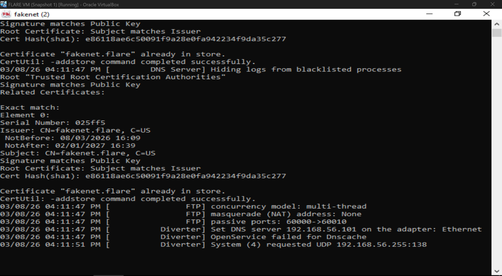

Figure 3  - pythonw.exe Properties
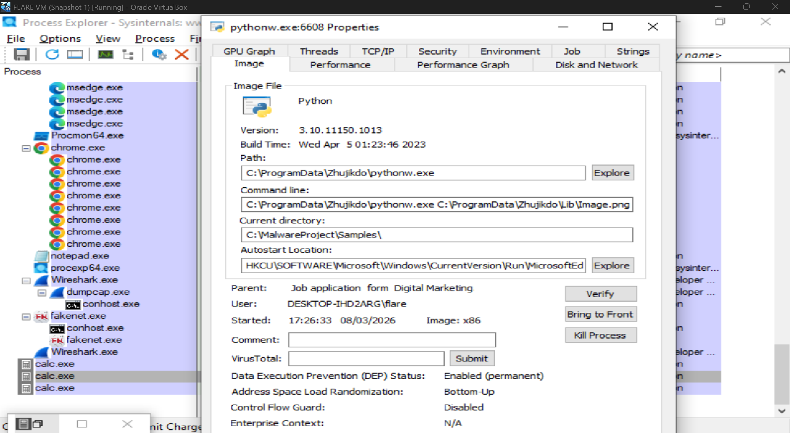

Figure 4  - Process Explorer when exe is clicked
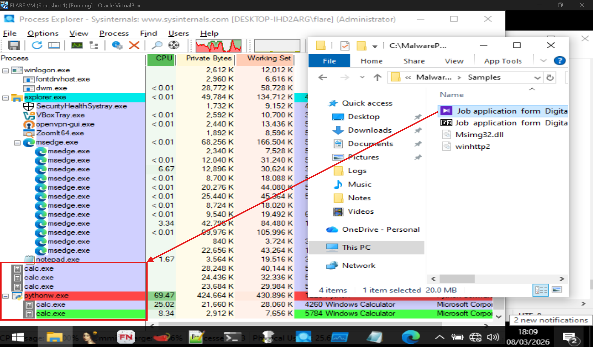

Figure 5  - Any.run analysis
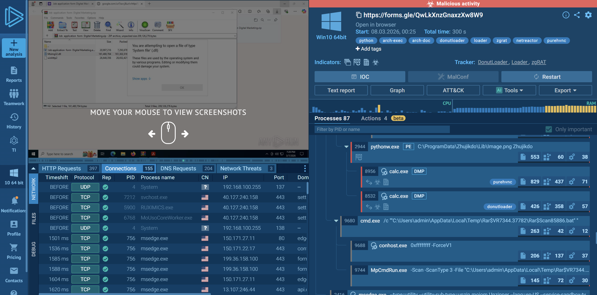

Figure 6 - Any.run MITRE ATT&CK Matrix
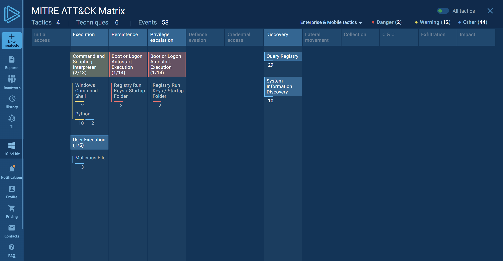

---

## REFERENCES

1. **MITRE ATT&CK Framework**  
   [https://attack.mitre.org/](https://attack.mitre.org/)

2. **MITRE ATT&CK Navigator**  
   [https://mitre-attack.github.io/attack-navigator/](https://mitre-attack.github.io/attack-navigator/)

3. **MITRE T1574.002 — DLL Side-Loading**  
   [https://attack.mitre.org/techniques/T1574/002/](https://attack.mitre.org/techniques/T1574/002/)

4. **MITRE T1547.001 — Registry Run Keys / Startup Folder**  
   [https://attack.mitre.org/techniques/T1547/001/](https://attack.mitre.org/techniques/T1547/001/)

5. **MITRE T1055 — Process Injection**  
   [https://attack.mitre.org/techniques/T1055/](https://attack.mitre.org/techniques/T1055/)

6. **DonutLoader: Malware Overview — ANY.RUN**  
   [https://medium.com/@anyrun/donutloader-malware-overview-00d9e3d79a48](https://medium.com/@anyrun/donutloader-malware-overview-00d9e3d79a48)

7. **Inside a Multi-Stage Windows Malware Campaign — Fortinet**  
   [https://www.fortinet.com/blog/threat-research/inside-a-multi-stage-windows-malware-campaign](https://www.fortinet.com/blog/threat-research/inside-a-multi-stage-windows-malware-campaign)

8. **Hotel Managers Targeted by ClickFix Phishing — PureRAT**  
   [https://www.blackhatethicalhacking.com/news/hotel-managers-targeted-by-clickfix-phishing-purerat-used-to-harvest-booking-com-credentials/](https://www.blackhatethicalhacking.com/news/hotel-managers-targeted-by-clickfix-phishing-purerat-used-to-harvest-booking-com-credentials/)

9. **DLL Hijacking: Definition, Tutorial & Prevention — Okta**  
   [https://www.okta.com/identity-101/dll-hijacking/](https://www.okta.com/identity-101/dll-hijacking/)

10. **Windows Data Protection API (DPAPI) — Microsoft**  
    [https://learn.microsoft.com/en-us/windows/win32/seccng/cng-dpapi](https://learn.microsoft.com/en-us/windows/win32/seccng/cng-dpapi)

11. **ANY.RUN Sandbox Analysis — Task a0cd19c6**  
    [https://app.any.run/tasks/a0cd19c6-c7d4-4287-bbba-eb7acb40e846](https://app.any.run/tasks/a0cd19c6-c7d4-4287-bbba-eb7acb40e846)
